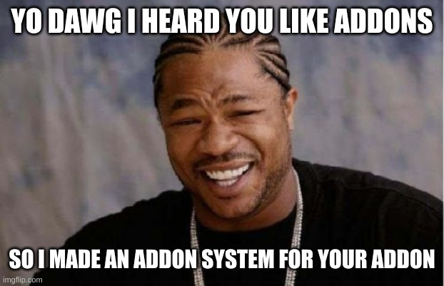

sauce4zwift-mod-example
========
An example implementation of a mod for Sauce for Zwift.




Basics
--------
A Sauce for Zwift "Mod" is a directory placed in `~/Documents/SauceMods`.  NOTE: "Documents"
may be called "My Documents" on some platforms.  For first time mod users they should create
an empty **SauceMods** folder first.  Then each Mod will be a sub directory in there such as...
```
Documents
└── SauceMods
    ├── neato_mod
    └── super_duper_theme_mod
```

Every Mod must contain a `manifest.json` file in the root path.  It must be PERFECT and
look something like this...
```json
{
    "manifest_version": 1,
    "name": "The Neato Mod",
    "description": "I make things neato",
    "version": "0.0.1",
    "content_js": [
        "./contents/run_everywhere.mjs"
    ],
    "content_css": [
        "./contents/see_everywhere.css"
    ],
    "web_root": "pages",
    "windows": [{
        "page": "pages/neato.html",
        "id": "neato-fun",
        "name": "Neato Mod",
        "description": "I am a neato window.  Neato + Sauce = Fun",
        "always_visible": false,
        "overlay": true,
        "default_bounds": {
            "width": 0.5,
            "height": 500,
            "x": 100,
            "y": -100
        }
    }]
}
```

File paths and references must not use special characters or use parent directory syntax
such as "../../../../etc/passwd".

Then make sure you have files laid out roughly like this repo has them.  Keep in mind that
the `web_root` is required for making the addon accessable from the Sauce web server. You
should be careful to not put any sensitive data in that path.  If you omit it, then only
native electron windows will be available.


Advanced
--------
The `content_js` and `content_css` arrays in the manifest allow you to inject JS and CSS into ALL
the windows.  Powerful but dangerous; be careful.
